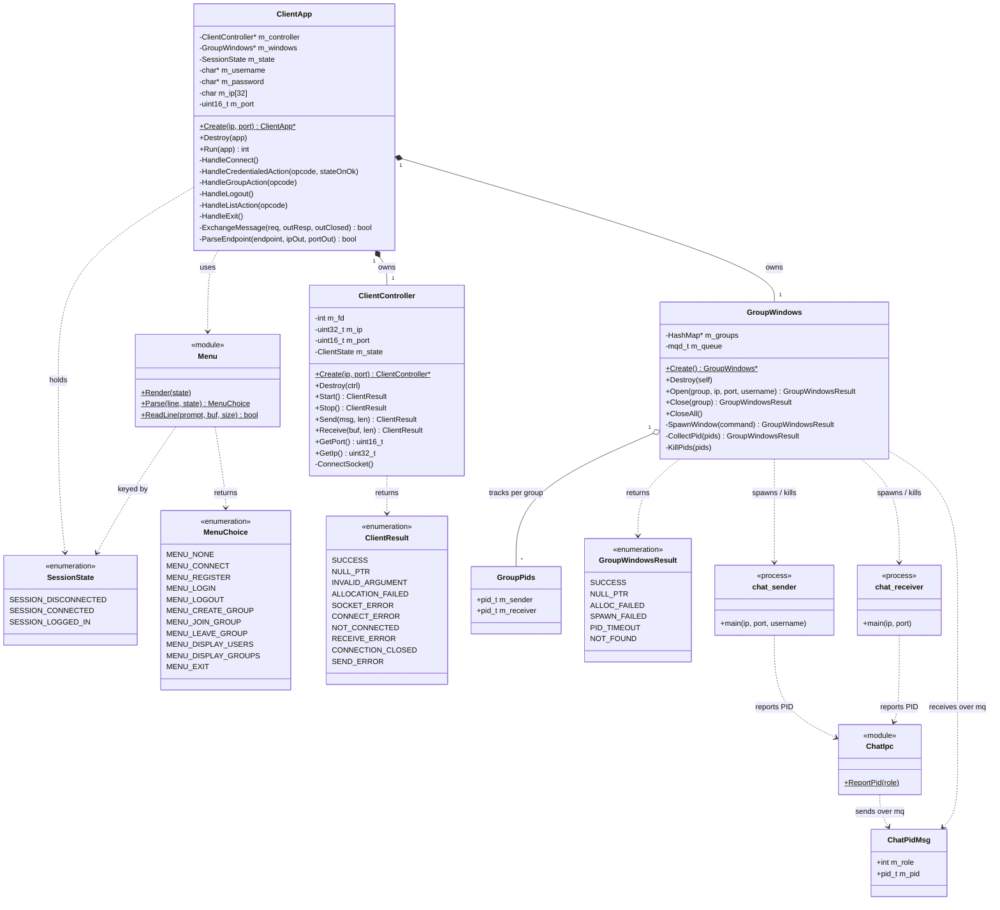
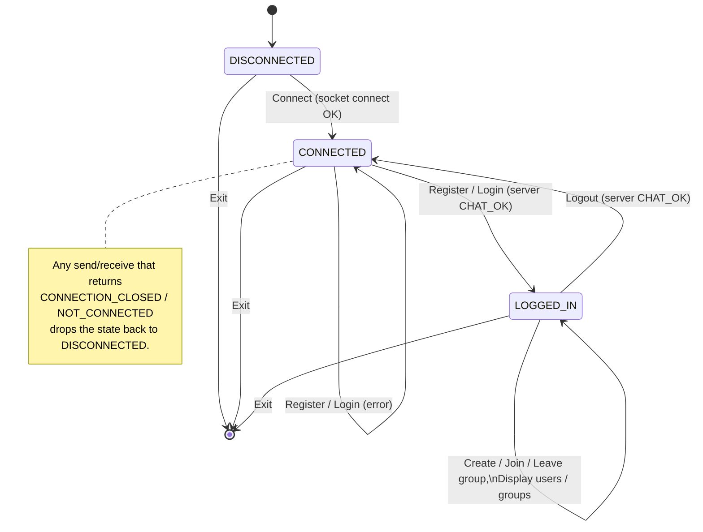
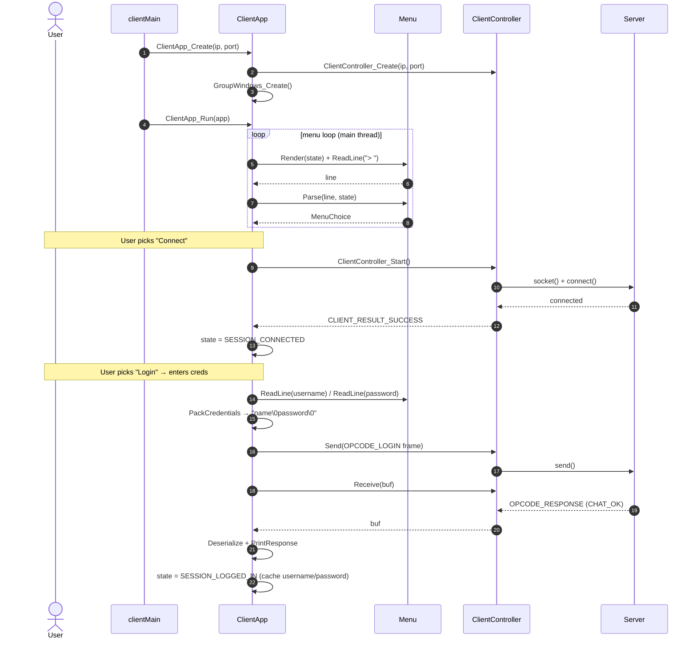
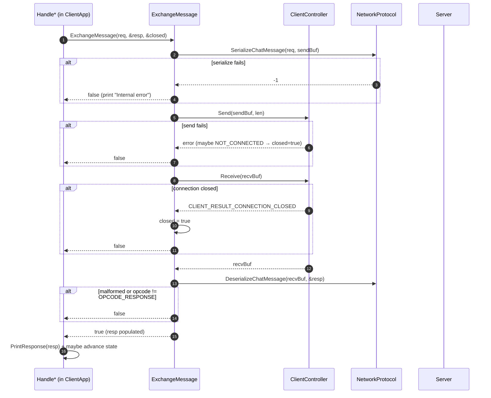
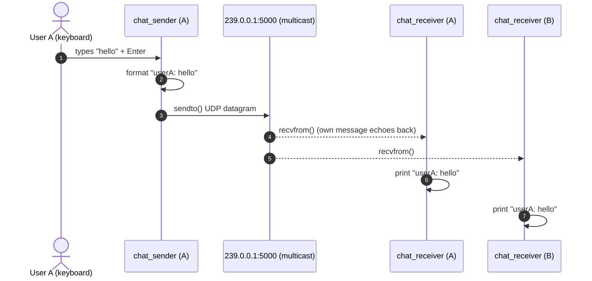

# Client Side — UML & Sequence Diagrams

This document gives a structural (UML class), behavioural (state machine), and
interaction (sequence) view of the **client half** of the chat-rooms project. It is
a companion to [`server-side.md`](./server-side.md) (the TCP control plane) and
[`multicast-chat.md`](./multicast-chat.md) (the UDP data plane); read those for the
server and protocol details this doc references.

The diagrams are written in [Mermaid](https://mermaid.js.org/). GitHub renders them
inline; in other viewers, paste the fenced blocks into the Mermaid live editor.

Contents:
1. [Component overview](#1-component-overview)
2. [Class diagram](#2-class-diagram)
3. [Session state machine](#3-session-state-machine)
4. [Sequence: startup → connect → login](#4-sequence-startup--connect--login)
5. [Sequence: a request/response round trip](#5-sequence-a-requestresponse-round-trip)
6. [Sequence: create/join a group (spawning chat windows)](#6-sequence-createjoin-a-group-spawning-chat-windows)
7. [Sequence: chat traffic over multicast](#7-sequence-chat-traffic-over-multicast)
8. [Sequence: leave / logout / exit teardown](#8-sequence-leave--logout--exit-teardown)
9. [Notes & observations](#9-notes--observations)
10. [File inventory](#10-file-inventory)

---

## 1. Component overview

```
   clientMain.c
        │  Create / Run / Destroy
        ▼
   ┌────────────────────────────────────────────────────────┐
   │ ClientApp  (orchestrator + menu loop + session state)    │
   │   ├─ Menu             render / parse state-aware menu     │
   │   ├─ ClientController TCP socket to the server            │
   │   └─ GroupWindows     spawns & tracks chat terminals      │
   └────────────────────────────────────────────────────────┘
          │ TCP control                       │ spawn (system) + kill (SIGTERM)
          ▼                                    ▼
      server                          chat_sender / chat_receiver
                                       (own gnome-terminal windows)
                                              │ report PID via POSIX mq
                                              ▼
                                       ChatIpc (shared ChatPidMsg contract)
```

The `ClientApp` is the only stateful orchestrator. It drives a blocking,
**single-threaded** menu loop on the main thread. Everything the user does is one of
a handful of menu actions that turn into a TLV request, a blocking round trip to the
server, and — for group actions — a side effect on the spawned chat windows.

---

## 2. Class diagram



**Ownership.** `ClientApp` owns exactly one `ClientController` and one
`GroupWindows`, both created in `ClientApp_Create` and torn down (reverse order) in
`ClientApp_Destroy`. `GroupWindows` owns a `HashMap` of *group-name → `GroupPids`*
and the POSIX message queue descriptor. `chat_sender` / `chat_receiver` are separate
**processes** (each in its own `gnome-terminal`), not objects in the client's address
space — the only thing the client keeps of them is their PIDs.

---

## 3. Session state machine

The client is a three-state machine; `Menu` shows only the actions legal in the
current state, and the handlers advance/retreat the state on the server's reply.



| State | Menu options (`Menu.c`) |
|-------|--------------------------|
| `SESSION_DISCONNECTED` | Connect, Exit |
| `SESSION_CONNECTED` | Register, Login, Exit |
| `SESSION_LOGGED_IN` | Logout, Create group, Join group, Leave group, Display users, Display groups, Exit |

Transitions in code:
- **Connect** → `HandleConnect` sets `SESSION_CONNECTED` only if `ClientController_Start` succeeds.
- **Register / Login** → `HandleCredentialedAction(..., SESSION_LOGGED_IN)` sets `LOGGED_IN` only when `resp.m_status == CHAT_OK`, caching the username/password.
- **Logout** → `HandleLogout` returns to `SESSION_CONNECTED` and closes all chat windows on `CHAT_OK`.
- **Any closed connection** → the handlers set `SESSION_DISCONNECTED` whenever `ExchangeMessage` reports `closed`.

---

## 4. Sequence: startup → connect → login



---

## 5. Sequence: a request/response round trip

Every server-backed action funnels through the private `ExchangeMessage` helper —
this is the single send-then-receive primitive. The diagram shows its decision
points.



Note the `closed` out-parameter: when it comes back `true`, the caller resets
`m_state` to `SESSION_DISCONNECTED`, which is how a server-side drop is reflected in
the menu on the very next render.

---

## 6. Sequence: create/join a group (spawning chat windows)

This is the most involved interaction: a control-plane round trip *plus* spawning two
helper processes and collecting their PIDs over the message queue.

```mermaid
sequenceDiagram
    autonumber
    actor User
    participant App as ClientApp
    participant Server
    participant GW as GroupWindows
    participant MQ as POSIX mq (/chat_pids)
    participant Recv as chat_receiver (window)
    participant Send as chat_sender (window)

    User->>App: Create/Join group → enters group name
    App->>Server: OPCODE_CREATE_GROUP / JOIN_GROUP ("group\0")
    Server-->>App: OPCODE_RESPONSE CHAT_OK, value="239.0.0.1:5000"
    App->>App: ParseEndpoint("ip:port") → ip, port

    App->>GW: GroupWindows_Open(group, ip, port, username)
    Note over GW: if group already tracked → Close() first
    GW->>Recv: system("gnome-terminal -- chat_receiver ip port")
    Recv->>MQ: ChatIpc_ReportPid(RECEIVER) → {role, pid}
    GW->>Send: system("gnome-terminal -- chat_sender ip port username")
    Send->>MQ: ChatIpc_ReportPid(SENDER) → {role, pid}

    loop collect 2 PIDs (mq_timedreceive, 5s deadline)
        MQ-->>GW: ChatPidMsg {role, pid}
        GW->>GW: store into GroupPids by role
    end
    alt a PID times out
        GW->>GW: KillPids(partial) ; return PID_TIMEOUT
    end
    GW->>GW: HashMap_Insert(strdup(group) → GroupPids)
    GW-->>App: GROUP_WINDOWS_SUCCESS
```

Why two windows arrive in arbitrary order: `gnome-terminal` returns immediately and
the helpers race to report their PID. `CollectPid` keys each arriving `ChatPidMsg` by
its `m_role`, and the `GroupPids` struct is `calloc`'d so an unset slot stays `0` —
which `KillPids` skips. That's why the loop doesn't care which window reports first.

---

## 7. Sequence: chat traffic over multicast

Once the windows are up, the **main client is out of the data path** — see
[`multicast-chat.md`](./multicast-chat.md). Messages flow client-to-client over UDP
multicast.



The receiver joins via `IP_ADD_MEMBERSHIP` and binds the port with `SO_REUSEADDR`
(so multiple clients can run on one host). The sender needs no join — it just
`sendto()`s the multicast address, tagging each line as `"username: text"`.

---

## 8. Sequence: leave / logout / exit teardown

The three teardown paths all converge on killing the right chat windows via
`SIGTERM`.

```mermaid
sequenceDiagram
    autonumber
    actor User
    participant App as ClientApp
    participant Server
    participant GW as GroupWindows
    participant Win as chat windows

    alt Leave group
        User->>App: Leave group → group name
        App->>Server: OPCODE_LEAVE_GROUP
        Server-->>App: CHAT_OK
        App->>GW: GroupWindows_Close(group)
        GW->>Win: kill(SIGTERM) sender + receiver
        GW->>GW: remove group from map
    else Logout
        User->>App: Logout
        App->>Server: OPCODE_LOGOUT
        Server-->>App: CHAT_OK
        App->>GW: GroupWindows_CloseAll()
        GW->>Win: SIGTERM every tracked pair
        App->>App: state = SESSION_CONNECTED
    else Exit
        User->>App: Exit (or EOF on stdin)
        App->>Server: OPCODE_EXIT (best-effort, errors ignored)
        App->>GW: GroupWindows_CloseAll()
        App->>App: ClientController_Stop() ; state = DISCONNECTED
    end
```

On full shutdown, `ClientApp_Destroy` calls `GroupWindows_Destroy`, which kills any
windows still open, frees the map, `mq_close`s and `mq_unlink`s the queue so it
doesn't linger in `/dev/mqueue`.

---

## 9. Notes & observations

Things worth knowing when reading or extending the client:

- **The `ClientController` is synchronous, despite its header.** `ClientController.h`
  documents a "threading contract" with an IO worker thread and `SetCallbacks`, but
  the implementation in `ClientController.c` is plain blocking `send()`/`recv()` with
  **no thread and no `SetCallbacks`**. The menu loop blocks on each round trip. The
  header doc describes an intended design that isn't (yet) built — don't trust it
  over the `.c`.
- **`Receive` uses a single `recv()`**, so it assumes a full response arrives in one
  read. Fine for the small fixed-size replies here, but not a general TLV framer.
- **`HandleLogout` sets `req.m_length = 0`** but still `memcpy`s the username into the
  value first; since the length is 0, the value is effectively unused on the wire
  (logout carries an empty payload, matching the protocol).
- **`Receive` returns `CLIENT_RESULT_SOCKET_ERROR` on `recv() < 0`** (the inline
  comment notes the renamed error); `ExchangeMessage` treats anything that isn't
  `SUCCESS` or `CONNECTION_CLOSED` as a generic receive failure.
- **Window spawn detection is two-stage.** `SpawnWindow` only catches "couldn't launch
  `gnome-terminal`" (non-zero `system()`); whether the helper actually started is
  confirmed by `CollectPid` receiving its PID within `CONF_CHAT_PID_WAIT_SECONDS`.
- **`gnome-terminal` is hard-coded.** Running on a box without it (headless/CI, KDE,
  macOS) makes group actions fail at `SpawnWindow`. The binary paths
  (`build/out.chat_sender` / `build/out.chat_receiver`) are relative to the client's
  CWD, so the client must be run from the repo root.

---

## 10. File inventory

| File | Role |
|------|------|
| `clientMain.c` | entry point: `Create` → `Run` → `Destroy` the `ClientApp` |
| **`Client/`** | |
| `ClientApp.{c,h}` | orchestrator: menu loop, session state, request/response handlers |
| `Menu.{c,h}` | state-aware menu render/parse + line reader |
| `GroupWindows.{c,h}` | spawn/track/kill the per-group chat windows; owns the PID queue |
| **`ClientNet/`** | |
| `ClientController.{c,h}` | TCP socket to the server: connect, blocking send/receive |
| **`ChatWindows/`** | |
| `chat_sender.c` | spawned process: keyboard → UDP multicast `sendto` |
| `chat_receiver.c` | spawned process: multicast join → print datagrams |
| **(root)** | |
| `ChatIpc.{c,h}` | shared `ChatPidMsg` contract; `ChatIpc_ReportPid` |
| `NetworkProtocol.h` | TLV wire codec shared with the server |
| `config.h` | `CONF_CHAT_*`, server IP/port, buffer sizes |

---

*Companion documents:* [`server-side.md`](./server-side.md) (TCP control plane) and
[`multicast-chat.md`](./multicast-chat.md) (UDP data plane & window orchestration).
