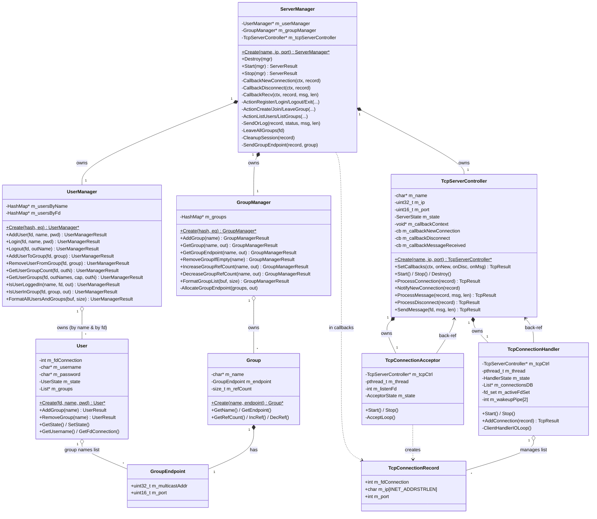
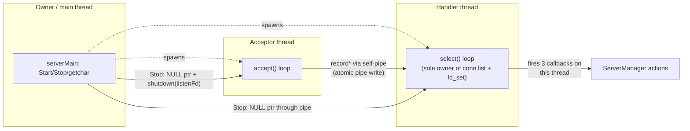
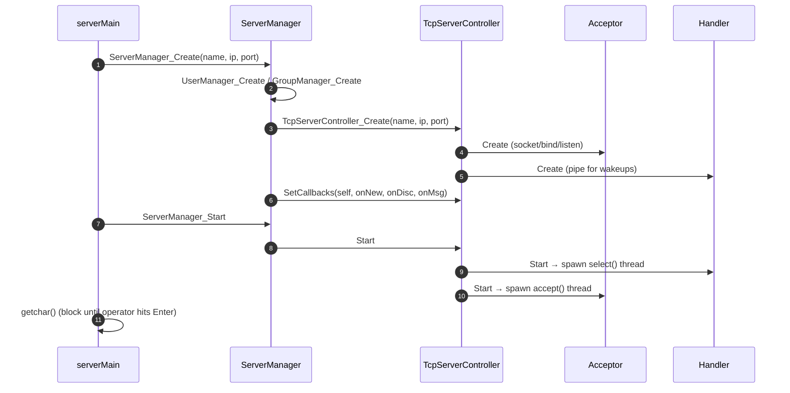
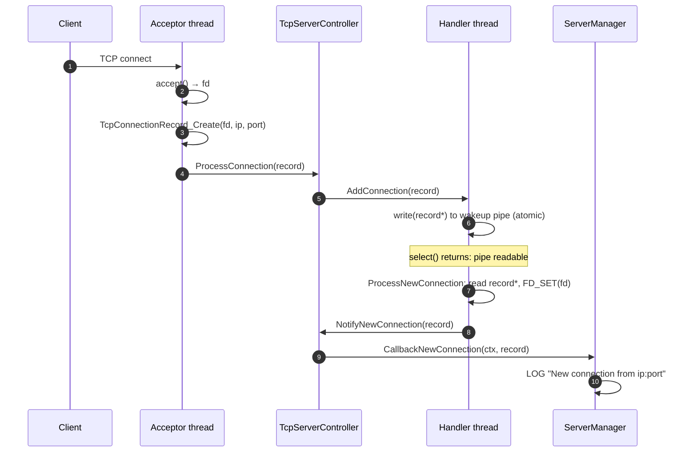
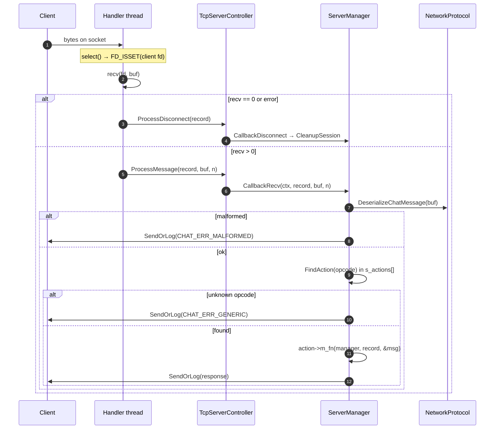
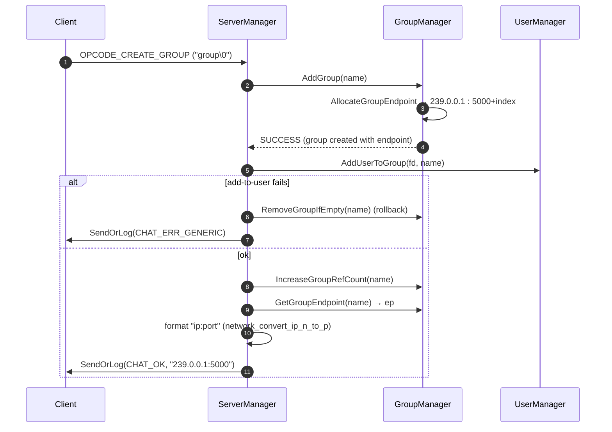
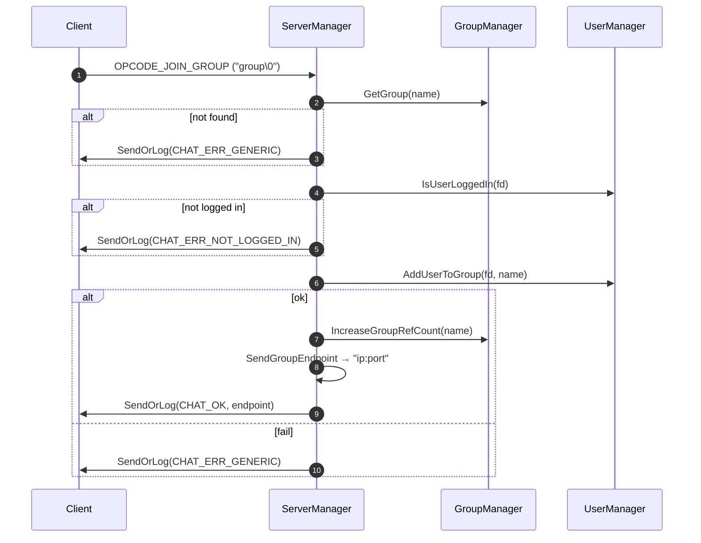
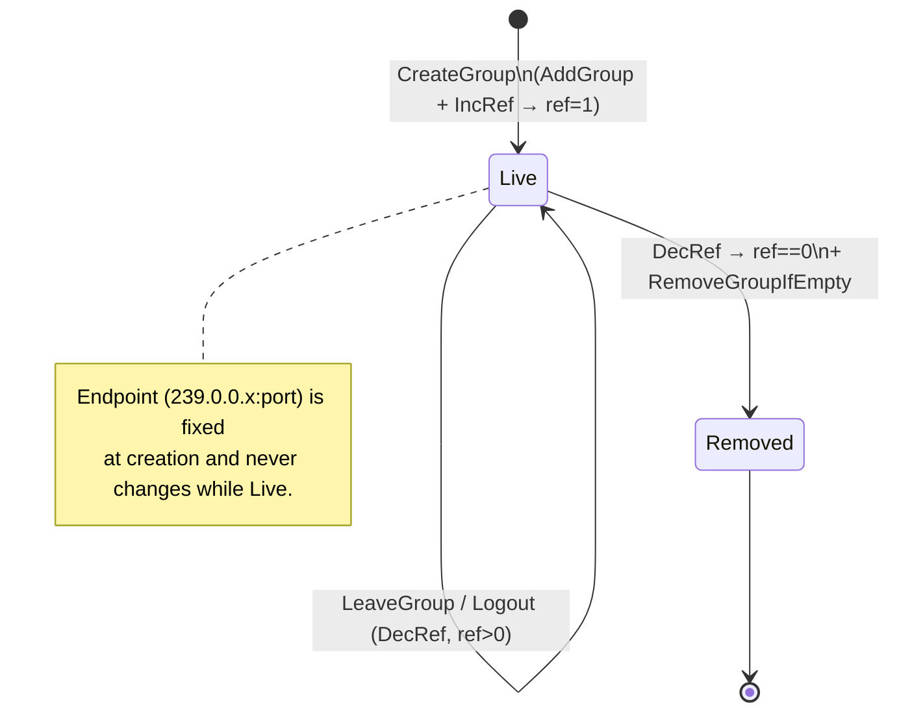

# Server Side — UML & Sequence Diagrams

This document gives a structural (UML class), behavioural (threading + group
lifecycle), and interaction (sequence) view of the **server half** of the chat-rooms
project. It is the diagram-focused companion to [`server-side.md`](./server-side.md)
(prose architecture) and mirrors [`client-side.md`](./client-side.md) on the client.

The diagrams are written in [Mermaid](https://mermaid.js.org/); GitHub renders them
inline.

Contents:
1. [Component overview](#1-component-overview)
2. [Class diagram](#2-class-diagram)
3. [Threading model](#3-threading-model)
4. [Sequence: startup](#4-sequence-startup)
5. [Sequence: accepting a connection (acceptor → handler)](#5-sequence-accepting-a-connection-acceptor--handler)
6. [Sequence: request dispatch (recv → action table)](#6-sequence-request-dispatch-recv--action-table)
7. [Sequence: create group](#7-sequence-create-group)
8. [Sequence: join group](#8-sequence-join-group)
9. [Sequence: leave / logout / disconnect cleanup](#9-sequence-leave--logout--disconnect-cleanup)
10. [Group lifecycle (ref-count state)](#10-group-lifecycle-ref-count-state)
11. [Notes & observations](#11-notes--observations)
12. [File inventory](#12-file-inventory)

---

## 1. Component overview

```
   serverMain.c
        │  Create / Start / Stop / Destroy
        ▼
   ┌────────────────────────────────────────────────────────┐
   │ ServerManager  (orchestrator + action dispatch)          │
   │   ├─ UserManager   users by-name / by-fd ── User          │
   │   └─ GroupManager  groups by-name ── Group(endpoint,ref)  │
   └────────────────────────────────────────────────────────┘
        │ registers 3 callbacks, replies via SendMessage
        ▼
   ┌────────────────────────────────────────────────────────┐
   │ TcpServerController  (transport façade)                  │
   │   ├─ TcpConnectionAcceptor   accept() loop thread         │
   │   └─ TcpConnectionHandler    select() I/O loop thread     │
   │   TcpConnectionRecord  (fd, ip, port) flows through       │
   └────────────────────────────────────────────────────────┘
        ▲ TCP control plane
   clients
```

`ServerNet` deals only in file descriptors and byte buffers; `ServerMng` deals only
in users, groups, and the chat protocol. The seam between them is **three
function-pointer callbacks** (new-connection, disconnect, message-received) plus
`TcpServerController_SendMessage` for replies.

---

## 2. Class diagram



**Key design points:**
- `UserManager` indexes users **twice** — `m_usersByName` (login lookup) and
  `m_usersByFd` (per-connection lookup). The same `User*` lives in both maps; the fd
  map is the one used during a live session.
- A `User`'s `m_groups` is a list of **group names** (strings), not `Group*` pointers
  — the server resolves names through `GroupManager` when it needs the endpoint.
- `Group` carries the multicast `GroupEndpoint` plus a **ref count** that drives
  teardown (see §10).

---

## 3. Threading model



Three threads, summarized:

| Thread | Runs | Owns / touches |
|--------|------|----------------|
| **Owner/main** | `Create`/`Start`/`Stop`/`Destroy`, blocks on `getchar()` | lifecycle only (serialized by controller mutex) |
| **Acceptor** | `accept()` loop | `m_listenFd`, `_Atomic m_state` |
| **Handler** | `select()` loop | the connection list, `fd_set`, `m_maxFd` — single-owner after `Start` |

**All three `ServerManager` callbacks run on the handler thread**, so every action
handler executes serially on one thread — which is why `UserManager`/`GroupManager`
currently need no locks. The acceptor passes a new `TcpConnectionRecord*` to the
handler through a **self-pipe** (atomic `write` of a pointer); a `NULL` pointer
through that pipe is the stop signal.

---

## 4. Sequence: startup



---

## 5. Sequence: accepting a connection (acceptor → handler)

The cross-thread hand-off that makes new-connection callbacks fire on the *handler*
thread, not the acceptor:



If the record pointer read back is `NULL`, that's the stop signal and the loop exits
instead of registering a connection.

---

## 6. Sequence: request dispatch (recv → action table)



The `s_actions[]` table maps each `OPCODE_*` to a `ServerManager_ActionXxx`
function; dispatch is a linear `FindAction` lookup. Every action replies exactly once
through `SendOrLog`.

---

## 7. Sequence: create group



Note the **rollback**: if the creator can't be added to the just-created group, the
empty group is removed so it never lingers.

---

## 8. Sequence: join group



---

## 9. Sequence: leave / logout / disconnect cleanup

All three teardown paths funnel through `LeaveAllGroups` (decrement ref counts,
reclaim empty groups). Disconnect and exit additionally tolerate a not-logged-in fd.

```mermaid
sequenceDiagram
    autonumber
    participant Client
    participant SM as ServerManager
    participant UM as UserManager
    participant GM as GroupManager

    alt Leave group (explicit)
        Client->>SM: OPCODE_LEAVE_GROUP ("group\0")
        SM->>GM: GetGroup + checks (logged in, in group)
        SM->>UM: RemoveUserFromGroup(fd, name)
        SM->>GM: DecreaseGroupRefCount(name)
        SM->>GM: RemoveGroupIfEmpty(name)
        SM->>Client: SendOrLog(CHAT_OK)
    else Logout / Exit / Disconnect
        Note over SM: Logout & Exit reply; Disconnect does not (peer gone)
        SM->>UM: IsUserLoggedIn(fd)? (else return)
        SM->>SM: LeaveAllGroups(fd)
        loop each group the user is in
            SM->>GM: DecreaseGroupRefCount(name)
            SM->>GM: RemoveGroupIfEmpty(name)
        end
        SM->>UM: Logout(fd, &username)
    end
```

---

## 10. Group lifecycle (ref-count state)

A group has no explicit "delete" command — it is reclaimed when its ref count
reaches 0.



---

## 11. Notes & observations

Carried over from reading the code (see [`server-side.md`](./server-side.md) §14 for
the full list):

- **Single-threaded request processing.** All actions run on the one handler thread,
  so the managers are lock-free *by design*; a future thread pool would require
  adding synchronization to `UserManager`/`GroupManager`.
- **Self-pipe does double duty.** New-connection hand-off and the stop signal share
  one pipe; a `NULL` pointer means "stop."
- **`ChatStatus` value collision.** `CHAT_ERR_NOT_IN_GROUP` and `CHAT_ERR_MALFORMED`
  are both `9` in `NetworkProtocol.h`.
- **Multicast port reuse.** `AllocateGroupEndpoint` derives the port from the live
  group *count*, so a removed group's port can be reassigned later.
- **`TcpConnectionRecord.m_ip`** is now sized `INET_ADDRSTRLEN` (was a hard-coded
  `16`).

---

## 12. File inventory

| File | Role |
|------|------|
| `serverMain.c` | entry point: create/start/stop/destroy `ServerManager` |
| **`ServerMng/`** | |
| `ServerManager.{c,h}` | orchestrator, callbacks, action table, send helpers |
| `UserManager.{c,h}` | user registry (by-name + by-fd), login/logout, membership |
| `User.{c,h}` | a single user (state, fd, password, group-name list) |
| `GroupManager.{c,h}` | group registry, endpoint allocation, ref counting |
| `Group.{c,h}` | a single group (name, endpoint, ref count) |
| **`ServerNet/`** | |
| `TcpServerController.{c,h}` | transport façade; owns acceptor + handler; `SendMessage` |
| `TcpConnectionAcceptor.{c,h}` | `accept()` loop thread |
| `TcpConnectionHandler.{c,h}` | `select()` I/O loop thread; owns the connection list |
| `TcpConnectionRecord.{c,h}` | per-connection value object (fd, ip, port) |
| `class_diagram.mmd` | original Mermaid class diagram of the `ServerNet` layer |

---

*Companion documents:* [`server-side.md`](./server-side.md) (prose architecture),
[`client-side.md`](./client-side.md) (client UML), and
[`multicast-chat.md`](./multicast-chat.md) (UDP data plane).
