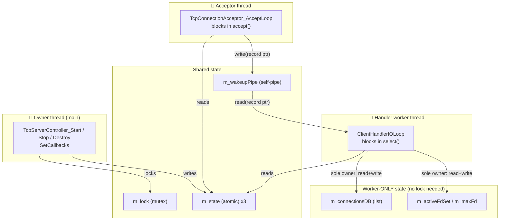
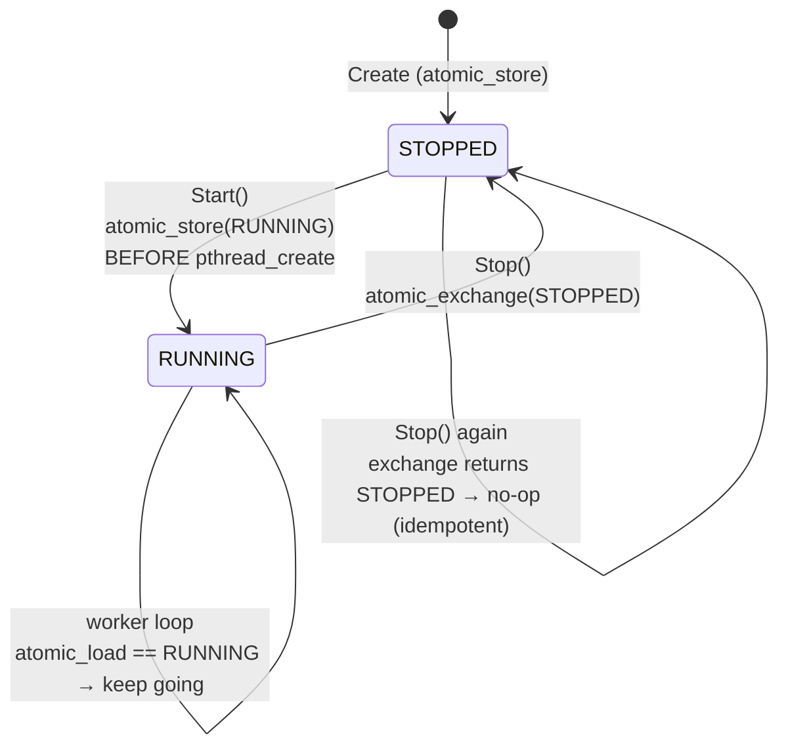
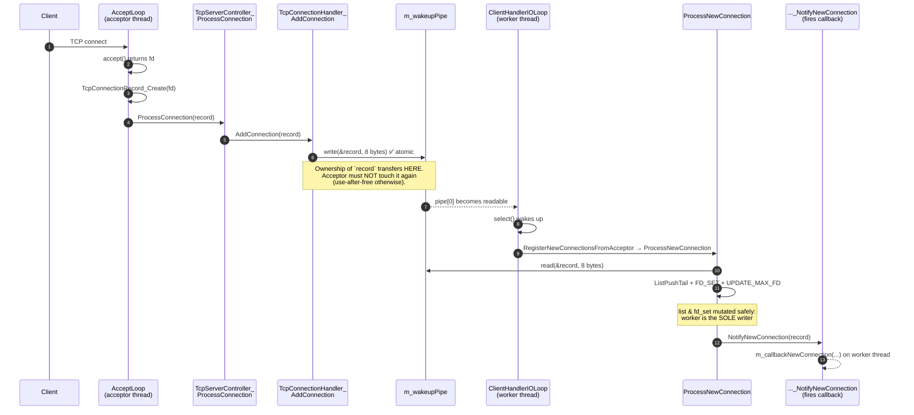
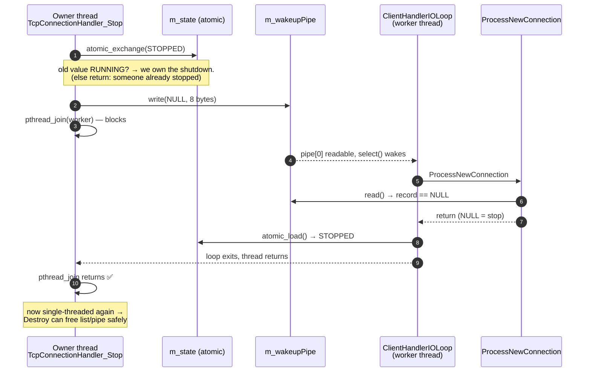
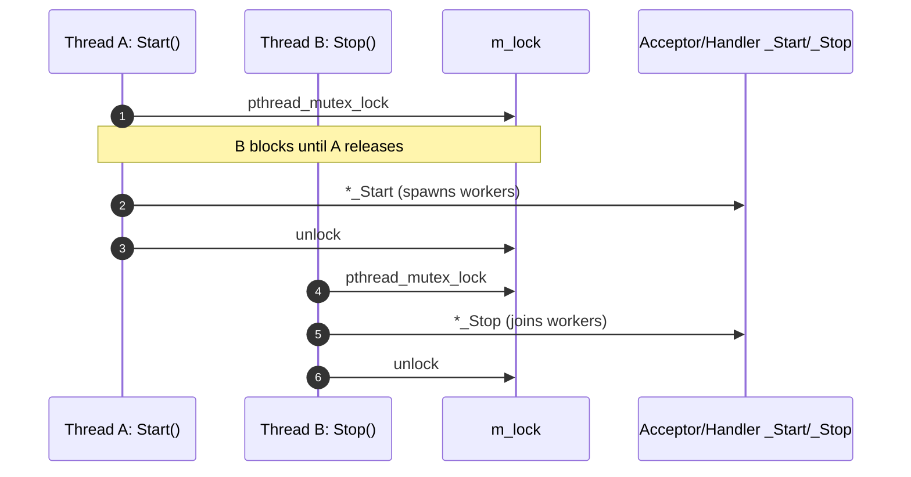

# ServerNet Thread Safety

How the TCP server stays correct across multiple threads **without locking the
hot path**. The whole design rests on four ideas:

1. **One mutex** (`TcpServerController.m_lock`) serializes lifecycle calls.
2. **Atomic state flags** (`_Atomic m_state`) signal "keep running / stop".
3. **A self-pipe** hands connections between threads with no lock.
4. **Single-owner invariant**: the connection list & `fd_set` are touched by
   exactly one thread, so they need no lock.

---

## 1. The threads and who owns what

There are **three threads** alive while the server runs.

**Read this as:** the owner thread is the only one that writes `m_state` and the
only one that holds the mutex. The acceptor and worker only *read* `m_state`.
The connection list and fd_set (bottom box) are touched by the **worker alone** —
that is why they need no mutex.

---

## 2. Atomic state flag — the "keep running / stop" switch

Every loop (`AcceptLoop`, `ClientHandlerIOLoop`) re-reads `m_state` each
iteration. `Stop()` flips it with `atomic_exchange`. The `_Atomic` keyword is
what stops the compiler from caching the flag in a register and looping forever.

Two subtle ordering rules the code follows:

- **Start stores `RUNNING` *before* `pthread_create`.** If it stored it after,
  a worker that started fast could read `STOPPED` on its first check and exit
  immediately — a dead handler. (`TcpConnectionHandler.c:166`)
- **Stop uses `atomic_exchange` and checks the *old* value.** Only the caller
  who actually flipped `RUNNING → STOPPED` is allowed to `pthread_join`. A
  second/concurrent Stop sees `STOPPED` and returns — joining twice is undefined
  behavior. (`TcpConnectionHandler.c:193`)

---

## 3. The self-pipe trick — handing a connection across threads (NO lock)

This is the heart of it. A new client is accepted on the **acceptor thread**,
but the connection list lives on the **worker thread**. Instead of locking the
list, the acceptor writes the *record pointer* through a pipe; the worker reads
it out and registers it on its own thread.

> POSIX guarantees a `write()` of `≤ PIPE_BUF` bytes is atomic. A pointer is
> 8 bytes, so the handoff can't be torn — no lock required.

**Why fire the callback on the worker (step ~10), not the acceptor?** Because
once the pointer is in the pipe the record belongs to the worker, which might
register/service/free it at any moment. Touching it on the acceptor — even just
to log it — is a use-after-free. Keeping the callback on the worker also means
**all three callbacks (new / message / disconnect) arrive in order, on one
thread**, so the application callback code never sees concurrency.

---

## 4. Graceful shutdown — the self-pipe doubles as a stop signal

`Stop()` has to unblock a worker that is asleep inside `select()`. It does this
by writing a **NULL pointer** through the same pipe. The worker reads it,
recognises NULL as "stop", and the loop's `atomic_load` then sees `STOPPED`.

The acceptor shuts down the same way in spirit, but its blocking call is
`accept()` instead of `select()`, so `Stop()` unblocks it with
`shutdown(m_listenFd)` rather than a pipe write. (`TcpConnectionAcceptor.c:157`)

---

## 5. The mutex — serializing lifecycle, NOT the hot path

The controller's `m_lock` guards only **Start / Stop / Destroy / SetCallbacks**.
The hot path (`ProcessConnection / ProcessMessage / ProcessDisconnect`) is
**lock-free**.

**How can the hot path skip the lock?** Because of one invariant:
`SetCallbacks` is **rejected while RUNNING** (`TcpServerController.c:437`). So
the callback pointers are frozen for the entire running phase. `pthread_create`
(in Start) and `pthread_join` (in Stop) act as happens-before edges that publish
those pointers to / retire them from the worker threads. The workers therefore
read a stable snapshot with no lock.

---

## Cheat sheet

| Question | Answer |
|---|---|
| How does the acceptor add a connection without locking the list? | Writes the record pointer through the self-pipe; the worker registers it. |
| Why is the pipe write safe without a lock? | POSIX: `write()` of ≤ `PIPE_BUF` bytes is atomic. |
| Who is allowed to touch `m_connectionsDB` / `m_activeFdSet`? | The worker thread, and only after `Start()`. Sole-owner = no lock. |
| How does `Stop()` wake a sleeping worker? | Handler: write NULL through the pipe. Acceptor: `shutdown(listenFd)`. |
| Why `_Atomic m_state`? | Stops the compiler caching the flag in a register; makes the cross-thread read well-defined. |
| Why store RUNNING *before* `pthread_create`? | So a fast worker doesn't read STOPPED and die on its first check. |
| Why `atomic_exchange` in Stop? | Only the thread that flips RUNNING→STOPPED joins. Prevents double-join UB. |
| Why is the hot path lock-free? | Callbacks are frozen while RUNNING (SetCallbacks rejected); create/join publish them. |
| Why fire the new-connection callback on the worker, not the acceptor? | Record ownership moved to the worker via the pipe; touching it on the acceptor = use-after-free. |
